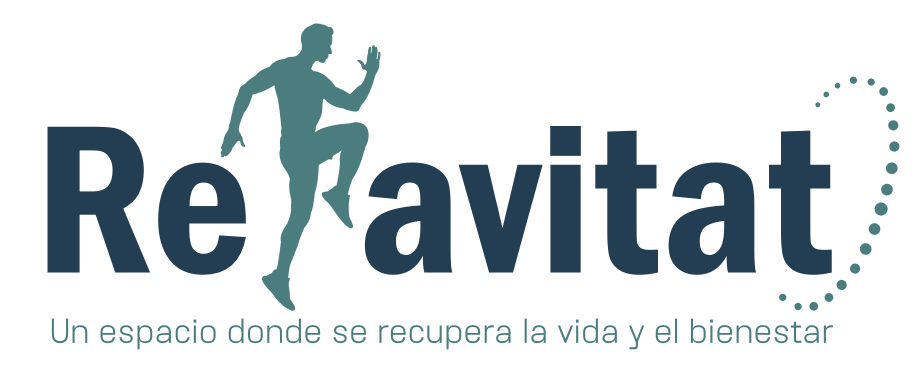
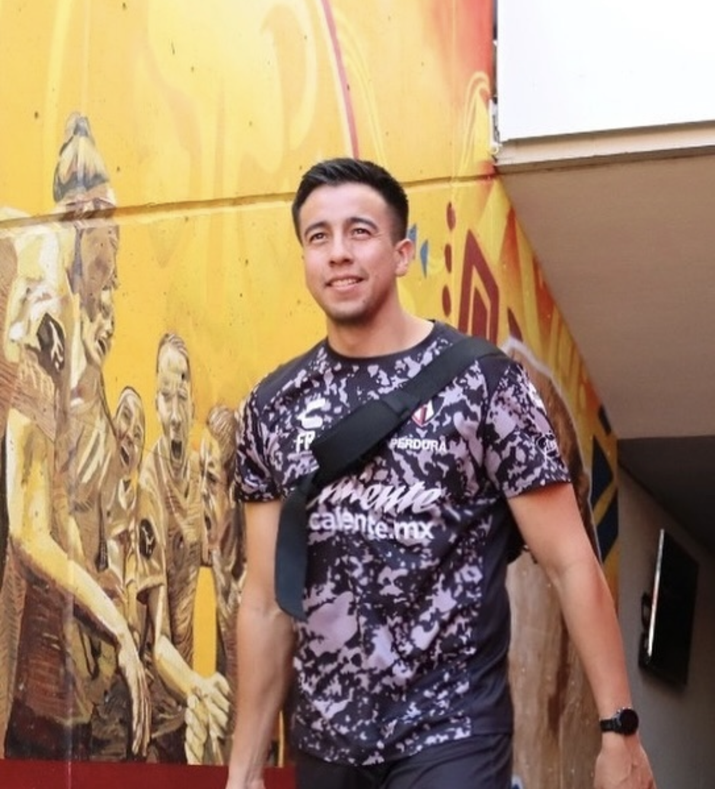
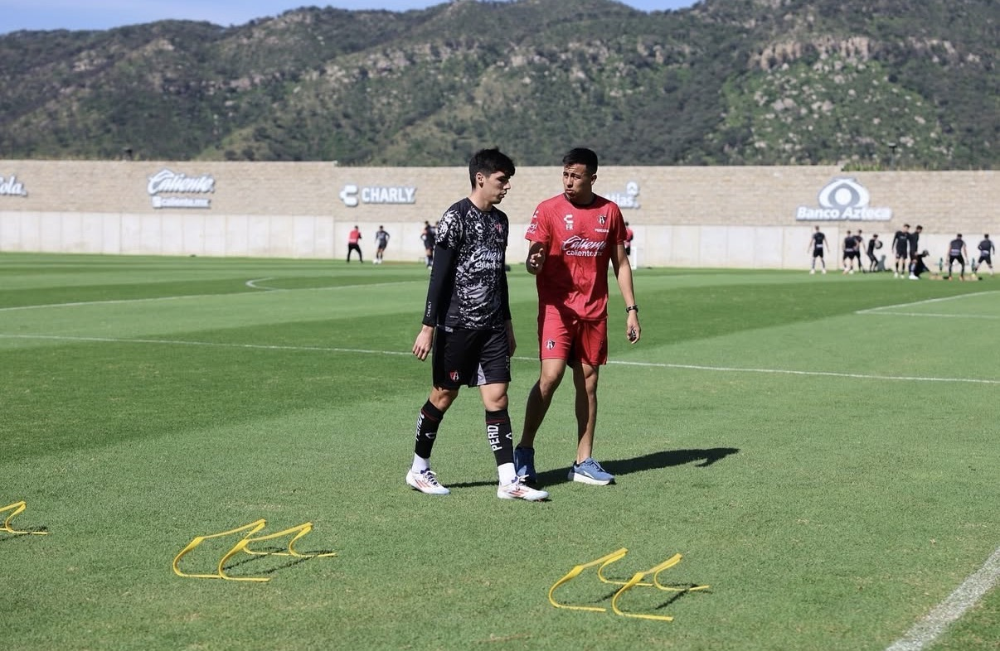
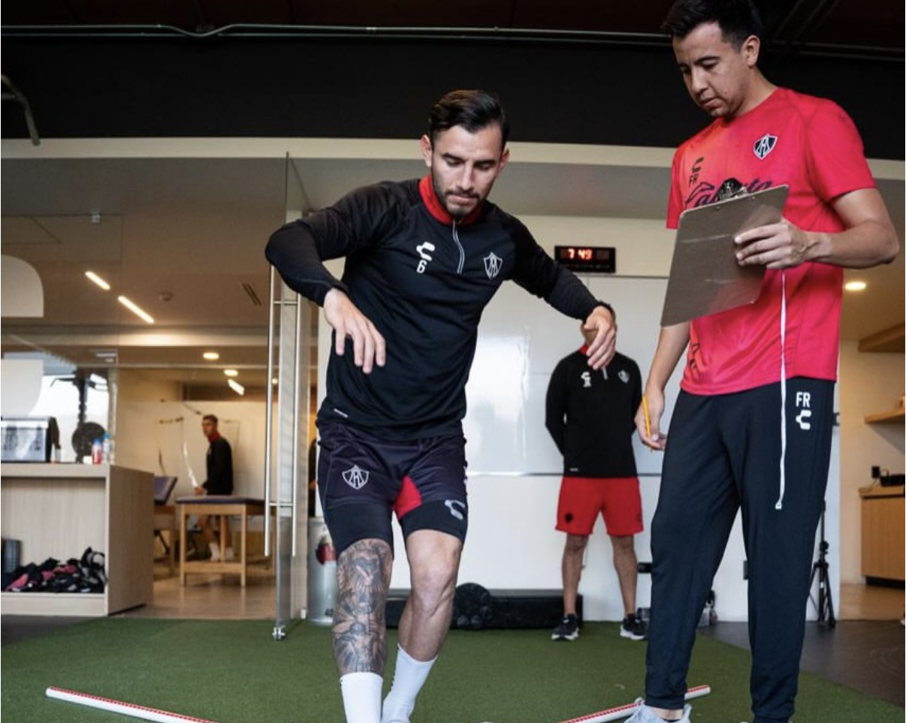

[index.html](https://github.com/user-attachments/files/28737521/index.html)
<!DOCTYPE html>
<html lang="es">
<head>
  <meta charset="UTF-8" />
  <meta name="viewport" content="width=device-width, initial-scale=1.0" />
  <title>RehabPro | Protocolos de Rehabilitación</title>
  
  
</head>
<body>

<!-- NAV -->
<nav>
  

  

    <a href="#patologias">Patologías</a>
    <a href="#protocolos">Protocolos</a>
    <a href="#como-funciona">Cómo funciona</a>
    <a href="#sobre-mi">Sobre mí</a>
    <a href="#protocolos" class="nav-cta">Comprar ahora</a>
  

</nav>

<!-- HERO -->
<section class="hero">
  
✦ Fisioterapia basada en evidencia

  <h1>Protocolos de Rehabilitación Clínica y Deportiva</h1>
  
Guías clínicas estructuradas, listas para aplicar, diseñadas por especialistas para las patologías más frecuentes en fisioterapia.

  

    <a href="#protocolos" class="btn-primary">Ver protocolos →</a>
    <a href="#patologias" class="btn-outline">Conocer más</a>
  

  

    

35+

Protocolos

    

8

Carpetas temáticas

    

PDF

Descarga inmediata

    

$159

MXN por carpeta

  

</section>

<!-- PATOLOGÍAS -->
<section id="patologias">
  
Áreas de especialidad

  <h2>Patologías más frecuentes</h2>
  
Protocolos desarrollados para las condiciones que más ves en consulta, tanto en el ámbito deportivo como en la práctica clínica general.

  

    <button class="tab-btn active" onclick="switchTab('deporte', this)">🏅 Deporte</button>
    <button class="tab-btn" onclick="switchTab('clinica', this)">🏥 Clínica</button>
  

  <!-- DEPORTE -->
  

    

      
🦵

      <h3>Lesión de LCA (Ligamento Cruzado Anterior)</h3>
      
Protocolo completo desde la fase aguda hasta el retorno deportivo, con criterios objetivos de progresión.

      Rodilla
    

    

      
🦶

      <h3>Esguince de tobillo</h3>
      
Manejo del esguince grado I-III, trabajo propioceptivo y prevención de recurrencias.

      Tobillo
    

    

      
💪

      <h3>Lesión del manguito rotador</h3>
      
Rehabilitación de desgarros parciales y totales con fases progresivas de fortalecimiento.

      Hombro
    

    

      
🏃

      <h3>Tendinopatía rotuliana</h3>
      
Protocolo de carga excéntrica y progresión funcional para el tendón rotuliano.

      Rodilla
    

    

      
🦿

      <h3>Distensión de isquiotibiales</h3>
      
Retorno seguro al deporte tras lesión muscular de isquiotibiales con criterios funcionales.

      Muslo
    

    

      
🩹

      <h3>Pubalgia del deportista</h3>
      
Abordaje multidisciplinar de la pubalgia con énfasis en la zona central y aductores.

      Cadera / Core
    

  

  <!-- CLÍNICA -->
  

    

      
🔙

      <h3>Dolor lumbar crónico</h3>
      
Abordaje biopsicosocial con ejercicio terapéutico, educación en dolor y estrategias de autogestión.

      Columna lumbar
    

    

      
🦴

      <h3>Osteoartritis de rodilla</h3>
      
Programa conservador basado en ejercicio para la gonalgia, con manejo del dolor y función.

      Rodilla
    

    

      
🫀

      <h3>Cervicalgia mecánica</h3>
      
Terapia manual, ejercicio cervical y corrección postural para el dolor cervical inespecífico.

      Columna cervical
    

    

      
🤲

      <h3>Síndrome del túnel carpiano</h3>
      
Rehabilitación conservadora con movilización nerviosa, férulas y ejercicios de deslizamiento.

      Muñeca / Mano
    

    

      
🦾

      <h3>Hombro doloroso</h3>
      
Síndrome de pinzamiento subacromial: protocolo de movilidad, fuerza y control motor escapular.

      Hombro
    

    

      
🧠

      <h3>Fibromialgia</h3>
      
Programa de ejercicio aeróbico, estiramientos y educación en neurociencia del dolor.

      Sistémico
    

  

</section>

<!-- Modal de ÉXITO (descarga) -->

  

    <button onclick="document.getElementById('success-modal').style.display='none'" style="position:absolute; top:12px; right:16px; background:none; border:none; font-size:1.4rem; cursor:pointer; color:#666;">✕</button>
    
🎉

    <h3 style="color:#0d2b45; font-size:1.3rem; margin-bottom:8px;">¡Pago completado!</h3>
    
Tu compra fue exitosa. Haz clic en el botón para acceder a tu carpeta en Google Drive.

    <a id="success-link" href="#" target="_blank"
      style="display:block; background:#22a99a; color:#fff; padding:14px; border-radius:10px; font-weight:800; font-size:1rem; text-decoration:none; margin-bottom:12px;">
      📥 Descargar mis protocolos →
    </a>
    
Guarda el enlace. También puedes contactarnos a <a href="mailto:alwaysnano1@gmail.com" style="color:#1a7f74;">alwaysnano1@gmail.com</a>

  

<!-- Modal de compra -->

  

    <button onclick="closeModal()" style="position:absolute; top:12px; right:16px; background:none; border:none; font-size:1.4rem; cursor:pointer; color:#666;">✕</button>
    
📄

    <h3 id="modal-title" style="color:#0d2b45; margin-bottom:4px; font-size:1.1rem;"></h3>
    
Protocolo de Rehabilitación · PDF

    

    

  

<!-- PROTOCOLOS -->
<section id="protocolos">
  
Tienda

  <h2>Protocolos de Rehabilitación</h2>
  
8 carpetas temáticas con todos los protocolos incluidos. Descarga inmediata vía Google Drive.

  <!-- BANNER BIBLIOTECA COMPLETA -->
  

    

      ⭐ Mejor valor
      <h3>Biblioteca Completa — 8 Carpetas · 35+ Protocolos</h3>
      
Todo el catálogo en un solo pago. Columna, hombro, rodilla, neurológico y más. Años de experiencia clínica y deportiva resumidos en protocolos listos para aplicar.

    

    

      
$1,272 MXN valor individual

      
$999 MXN

      
Ahorras $273 · 21% OFF

    

    <button class="library-btn" onclick="openModal('Biblioteca Completa — 8 Carpetas Rehavitat','📚','999.00','ALL')">
      🛒 Comprar biblioteca completa
    </button>
  

  <!-- GRID DE 8 CARPETAS -->
  

    <!-- Generado por JavaScript -->
  

</section>

<!-- CÓMO FUNCIONA -->
<section id="como-funciona">
  
Proceso

  <h2>¿Cómo funciona?</h2>
  
Compra simple y entrega inmediata en 3 pasos.

  

    

      
1

      <h3>Elige tu protocolo</h3>
      
Selecciona el protocolo o pack que necesitas para tu práctica clínica o deportiva.

    

    

      
2

      <h3>Paga con PayPal</h3>
      
Completa tu pago de forma segura con tu cuenta PayPal o con tarjeta de crédito/débito.

    

    

      
3

      <h3>Descarga tu PDF</h3>
      
Recibirás el enlace de descarga de inmediato al correo que registraste en PayPal.

    

    

      
4

      <h3>Aplica en clínica</h3>
      
Usa el protocolo directamente con tus pacientes. Imprimible y digital.

    

  

</section>

<!-- SOBRE MÍ -->
<section id="sobre-mi">
  

    

      

      <!-- Logro estrella -->
      

        
🏆

        <strong style="display:block; color:#1c2b3a; font-size:.95rem; margin-top:4px;">Campeón Liga MX</strong>
        Atlas FC · Clausura 2022 · Bicampeones
      

    

    

      
Quién soy

      <h2>Fernando Martínez Roldán</h2>

      

        

          <strong>+8</strong>
          Años de experiencia
        

        

          <strong>Atlas FC</strong>
          Primera División Liga MX
        

        

          <strong>Máster</strong>
          Readaptación de Lesiones FSI
        

      

      
Soy fisioterapeuta y readaptador del <strong>Primer Equipo Varonil de Atlas F.C.</strong> en la Liga MX. He acompañado al equipo en uno de sus mejores momentos históricos: el <strong>bicampeonato Clausura 2022</strong>. Trabajo diariamente con futbolistas profesionales, diseñando y ejecutando procesos de rehabilitación de alto nivel.

      
Mis protocolos son el resultado de años de experiencia clínica y deportiva, combinando la mejor evidencia científica con la práctica real. Cada PDF concentra el conocimiento que he construido a lo largo de mi carrera para que puedas aplicarlo desde el primer día.

      

        🎓 Universidad Valle de México
        🏅 Especialista G-SE (España)
        📚 Physio Network · López Chicharro
        ⚽ Atlas FC desde 2019
        🦴 Ortopédica · Deportiva · Geriátrica
      

    

  

  <!-- Galería debajo del perfil -->
  

    
    
    
  

</section>

<!-- GARANTÍA -->

  
🛡️

  <h2>Garantía de satisfacción</h2>
  
Si el contenido no cumple tus expectativas, contáctame dentro de los 7 días y te reembolso el 100%. Sin preguntas.

<!-- CONTACTO -->
<section id="contacto">
  
Contacto

  <h2>¿Tienes alguna pregunta?</h2>
  
Escríbeme antes de comprar o si necesitas información sobre algún protocolo específico.

  

    

      <h3>Información de contacto</h3>
      

        
📧

        

          <strong>Correo electrónico</strong>
          
alwaysnano1@gmail.com

        

      

      

        
💬

        

          <strong>WhatsApp</strong>
          
Escríbeme para consultas rápidas sobre los protocolos

        

      

      

        
⏰

        

          <strong>Tiempo de respuesta</strong>
          
Respondo en menos de 24 horas

        

      

    

    

      <h3>Envíame un mensaje</h3>
      <form onsubmit="sendMail(event)">
        

          <label>Nombre completo</label>
          <input type="text" id="fname" placeholder="Tu nombre" required>
        

        

          <label>Correo electrónico</label>
          <input type="email" id="femail" placeholder="tu@correo.com" required>
        

        

          <label>Asunto</label>
          <select id="fsubject">
            <option>Consulta sobre un protocolo</option>
            <option>Solicitar protocolo personalizado</option>
            <option>Problema con mi compra</option>
            <option>Otro</option>
          </select>
        

        

          <label>Mensaje</label>
          <textarea id="fmessage" placeholder="¿En qué puedo ayudarte?"></textarea>
        

        <button type="submit" class="btn-submit">Enviar mensaje →</button>
      </form>
    

  

</section>

<!-- FOOTER -->
<footer>
  
© 2026 RehabPro — Fernando Martínez Roldán · <a href="mailto:alwaysnano1@gmail.com">alwaysnano1@gmail.com</a>

  
Los protocolos son material educativo profesional. No sustituyen el juicio clínico del fisioterapeuta.

</footer>

</body>
</html>
